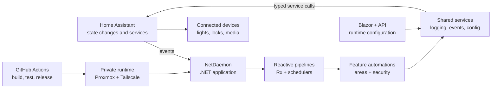

# HomeAutomation

**A production-oriented, event-driven automation platform for Home Assistant.**

[](https://github.com/dani-rodr/HomeAutomation/actions/workflows/ci-cd.yml)


HomeAutomation coordinates lights, media, security, notifications, and connected devices through **.NET 10, C#, NetDaemon, Home Assistant, and reactive streams**. It is built as a long-running service rather than a collection of isolated scripts: live state changes enter reactive pipelines, feature automations apply domain rules, and shared services handle device calls, configuration, logging, and lifecycle management.

## At A Glance

| | |
| --- | --- |
| **Runtime** | .NET 10, ASP.NET Core, NetDaemon |
| **Automation model** | Rx observables, state transitions, schedules, webhooks |
| **Application surface** | Blazor Server and ASP.NET Core controllers |
| **Integration** | Generated, strongly typed Home Assistant entities and services |
| **Testing** | xUnit, FluentAssertions, Moq, Microsoft.Reactive.Testing |
| **Delivery** | GitHub Actions, release artifacts, SSH/rsync, Tailscale |
| **Runtime environment** | Home Assistant, NetDaemon add-on, Proxmox LXC |

## Architecture



### Event flow

1. Home Assistant publishes a state change, webhook, or scheduled event.
2. NetDaemon exposes it through generated entities and reactive extensions.
3. An area or security automation applies the relevant domain rules.
4. Shared services perform device calls and record operational activity.
5. The automation remains active until its lifecycle disposes the subscriptions.

## A Real Automation

The bathroom light automation composes motion events, configurable delays, a master switch, and a shared dimming service:

```csharp
protected override IEnumerable<IDisposable> GetLightAutomations()
{
    yield return MotionSensor
        .OnOccupied()
        .Subscribe(e => dimmingController.OnMotionDetected(Light));

    yield return MotionSensor
        .OnCleared()
        .SubscribeAsync(async _ =>
            await dimmingController.OnMotionStoppedAsync(Light));
}
```

The automation returns its subscriptions to the lifecycle manager. That makes the behavior switchable, testable, and disposable instead of leaving unmanaged observers attached to a long-running process.

Source: [`Bathroom/Automations/LightAutomation.cs`](src/HomeAutomation/apps/Area/Bathroom/Automations/LightAutomation.cs)

## Engineering Decisions

### Feature-local boundaries

The project is organized around areas and capabilities. Each feature owns the entity contracts and device facade it needs, while genuinely shared behavior lives under `Common`.

```text
src/HomeAutomation/apps/
|-- Area/
|   |-- Bathroom/
|   |-- Bedroom/
|   |-- LivingRoom/
|   `-- Pantry/
|-- Common/
|-- Helpers/
`-- Security/
```

This keeps automations focused on behavior instead of coupling every feature to a global device graph.

### Long-running reliability

- Automation subscriptions are tracked and disposed with the automation lifecycle.
- Reactive callbacks use safe error handling so one event does not silently terminate a stream.
- Webhook registration and startup paths include cleanup and compensation behavior.
- Runtime settings are validated and separated from deployment configuration.
- Structured logs can be written to both application output and Home Assistant Logbook.

### Generated integration boundary

Home Assistant entities and services are generated from metadata into [`HomeAssistantGenerated.cs`](src/HomeAutomation/HomeAssistantGenerated.cs). The application gets compile-time discoverability at the integration boundary instead of repeating untyped entity and service strings throughout the automation code.

## Testing

The test suite exercises event-driven behavior against mocked Home Assistant contexts. It covers motion transitions, master-switch behavior, unavailable sensor transitions, service calls, schedulers, security workflows, logging, and shared services.

The bathroom automation tests use virtual time and explicit state simulation:

```csharp
_mockHaContext.SimulateStateChange(
    _entities.MasterSwitch.EntityId,
    "off",
    "on");

_mockHaContext.ShouldHaveCalledLightTurnOn(_entities.Light.EntityId);
```

Source: [`LightAutomationTests.cs`](tests/HomeAutomation.Tests/Area/Bathroom/Automations/LightAutomationTests.cs)

Coverage collection is configured for the automation layer with minimum line, branch, and method thresholds. The CI workflow publishes the resulting reports as build artifacts.

Run locally:

```bash
dotnet test --configuration Release \
  --collect:"XPlat Code Coverage" \
  --settings build/coverlet.runsettings
```

## Delivery And Operations

The CI/CD workflow builds the application and provides the delivery path used by the project:

- Restores and caches .NET dependencies
- Runs release tests and coverage collection
- Publishes a deployable artifact
- Creates versioned ZIP releases
- Skips deployment when application source has not changed
- Uses Tailscale to reach private infrastructure
- Deploys with SSH/rsync
- Restarts the NetDaemon runtime through the Home Assistant API
- Sends deployment status notifications

Infrastructure setup and operational notes are documented in [`infra/proxmox-lxc/README.md`](infra/proxmox-lxc/README.md). The workflow itself is in [`.github/workflows/ci-cd.yml`](.github/workflows/ci-cd.yml).

## Project Layout

| Path | Responsibility |
| --- | --- |
| `src/HomeAutomation/apps/Area/` | Room-specific automations and entity contracts |
| `src/HomeAutomation/apps/Common/` | Shared services, settings, logging, and contracts |
| `src/HomeAutomation/apps/Security/` | Locks, presence, access, and security workflows |
| `src/HomeAutomation/Web/` | Runtime configuration controllers and UI |
| `tests/HomeAutomation.Tests/` | Unit and reactive automation tests |
| `build/` | Publishing and coverage configuration |
| `infra/proxmox-lxc/` | Private infrastructure and deployment documentation |

## Getting Started

<details>
<summary>Local development</summary>

### Prerequisites

- .NET 10 SDK
- A running Home Assistant instance
- A Home Assistant token for the configured NetDaemon connection
- Home Assistant entities matching the application configuration

### Build and run

```bash
dotnet restore
dotnet build
dotnet run --project src/HomeAutomation/HomeAutomation.csproj
```

The default web ports are HTTP `10000` and HTTPS `10001` when HTTPS is enabled in `src/HomeAutomation/appsettings.json`.

Keep tokens and private host details in local or deployment-specific configuration. Do not commit credentials.

### Refresh generated models

```bash
nd-codegen
```

Generated output is written to `src/HomeAutomation/HomeAssistantGenerated.cs`.

### Publish

```bash
dotnet publish src/HomeAutomation/HomeAutomation.csproj \
  --configuration Release
```

</details>

## AI-Assisted Development

AI tools were used to accelerate implementation and investigation. Architecture, integration decisions, debugging, security review, tests, and operational validation remained human-directed. Generated changes were reviewed, compiled, tested, and adapted to the project conventions before being retained.
